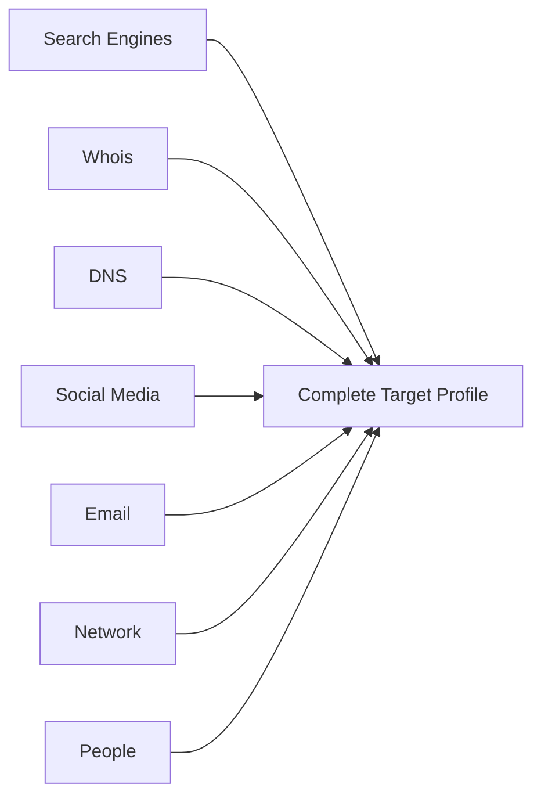

<h1 align="center">🕵️- Module 02</h1>

<h3 align="center">Footprinting & Reconnaissance</h3>

<p align="center">


</p>

---

# 📖 Overview

Footprinting (Reconnaissance) is the **first phase of Ethical Hacking**. During this phase, an attacker or ethical hacker collects as much information as possible about a target before interacting with it.

The collected information becomes a **blueprint** of the target organization and helps identify vulnerabilities before launching further attacks such as **Scanning**, **Enumeration**, or **Exploitation**.

> [!IMPORTANT]
> Footprinting is considered the foundation of every penetration test. Better reconnaissance leads to better attack planning and stronger security assessments.

---

# 📚 Table of Contents

- Learning Objectives
- Footprinting Concepts
- Types of Footprinting
- Information Gathered
- Objectives
- Threats
- Footprinting Methodology
- Search Engine Footprinting
- Google Dorking
- Specialized Search Engines
- Internet Research Services
- Social Media Footprinting
- Whois Footprinting
- DNS Footprinting
- Network & Email Footprinting
- Social Engineering Footprinting
- Advanced Footprinting Tools
- AI-Powered Reconnaissance
- Countermeasures
- Quick Revision
- Interview Questions
- Module Summary

---

# 🎯 Learning Objectives

After completing this module, you should be able to:

- ✅ Understand Footprinting concepts
- ✅ Differentiate Passive and Active Reconnaissance
- ✅ Perform Search Engine Footprinting
- ✅ Use Google Dorks effectively
- ✅ Perform Whois Footprinting
- ✅ Perform DNS Footprinting
- ✅ Gather information from Social Media
- ✅ Perform Email & Network Footprinting
- ✅ Use AI-powered reconnaissance tools
- ✅ Apply Footprinting countermeasures

---

# 🛡️ What is Footprinting?

Footprinting is the systematic process of collecting information about a target organization.

The objective is to identify:

- Organization details
- Employees
- Email addresses
- Domains
- Servers
- Technologies
- Public infrastructure
- Security weaknesses

The information collected helps create a complete security profile of the target.

---

# 🎯 Why is Footprinting Important?

Footprinting helps security professionals to:

- Identify attack surface
- Discover hidden assets
- Understand network architecture
- Identify technologies in use
- Detect exposed services
- Prepare for vulnerability assessment

> [!TIP]
> The more information gathered during Footprinting, the easier the later phases become.

---

# 🔍 Types of Footprinting

| Passive Footprinting | Active Footprinting |
|---------------------|--------------------|
| No direct interaction | Direct interaction with target |
| Difficult to detect | Easier to detect |
| Uses OSINT | Uses scanning tools |
| Low Risk | Higher Risk |
| Search engines, Whois, Social Media | Nmap, DNS queries, Banner grabbing |

---

# 📦 Information Gathered During Footprinting

## 🏢 Organizational Information

- Company Name
- Employee Details
- Phone Numbers
- Email Addresses
- Office Locations
- Partners
- Vendors
- Technologies Used
- Press Releases
- Financial Reports

---

## 🌐 Network Information

- Domain Names
- Subdomains
- Public IP Addresses
- DNS Records
- Network Topology
- Firewalls
- VPN Portals

---

## 💻 System Information

- Operating Systems
- Web Servers
- Email Servers
- Technologies
- CMS
- Cloud Services
- Open Ports

---

# 🎯 Objectives of Footprinting

- Map the target network
- Discover public assets
- Identify security controls
- Build target database
- Support Social Engineering
- Discover vulnerabilities
- Reduce attack uncertainty

---

# ⚠️ Threats of Footprinting

Improperly protected information may lead to:

- Social Engineering
- Identity Theft
- Corporate Espionage
- Data Leakage
- Targeted Cyber Attacks
- Privacy Violations
- Business Loss

---

# 🗂️ Footprinting Methodology



---

# 🌍 Footprinting Through Search Engines

Search engines index billions of web pages that can reveal:

- Login portals
- Employee names
- Documents
- Email addresses
- Technology stack
- Backup files
- Configuration files

Popular Search Engines:

- Google
- Bing
- Yahoo
- DuckDuckGo

---

# 🔎 Google Dorking

Google Dorking uses advanced search operators to discover hidden information.

## Common Operators

| Operator | Purpose |
|-----------|----------|
| site: | Search specific website |
| inurl: | Search URL |
| intitle: | Search page title |
| intext: | Search page content |
| filetype: | Search specific file |
| cache: | Cached pages |
| related: | Similar websites |
| info: | Website information |

---

## Examples

```text
site:example.com

site:example.com login

site:example.com filetype:pdf

site:example.com inurl:admin

intitle:"Index of"

filetype:xlsx password

site:gov.in confidential

intext:"username"

inurl:php?id=
```

---

> [!WARNING]
> Google Dorking should only be performed against systems you are authorized to assess.

---

# 📚 Google Hacking Database (GHDB)

GHDB contains thousands of pre-built Google Dorks.

Categories include:

- Login Pages
- Password Files
- Error Messages
- Sensitive Directories
- Configuration Files
- Database Dumps
- Vulnerable Applications

---

# 🤖 AI-Enhanced Google Dorking

AI tools can automatically generate:

- Google Dorks
- Search Queries
- Recon Reports
- Parsing Scripts

Examples:

- ChatGPT
- ShellGPT
- DorkGPT

---

# 🌐 Specialized Search Engines

## Shodan

> Google for Internet-connected devices.

Finds:

- Routers
- Firewalls
- Cameras
- SCADA Systems
- VPN Servers
- IoT Devices

---

## Other Search Engines

| Engine | Purpose |
|---------|----------|
| Shodan | Internet Devices |
| Censys | Internet Assets |
| ZoomEye | Cyber Asset Search |
| Netcraft | Website Information |
| SecurityTrails | DNS History |

---

# 🌎 Internet Research Services

Useful OSINT resources include:

### Domain Research

- Netcraft
- DNSDumpster
- Sublist3r
- dig

---

### Historical Websites

- Archive.org
- Photon

---

### People Search

- Pipl
- Spokeo

---

### Business Intelligence

- Crunchbase
- OpenCorporates
- Google Finance

---

### Competitive Intelligence

- EDGAR
- D&B Hoovers
- LexisNexis

---

### Monitoring

- Google Alerts

---

### Source Code Search

- GitHub
- Recon-ng

---

# 👥 Social Media Footprinting

Social media provides valuable intelligence including:

- Employee names
- Job roles
- Contact details
- Office photos
- Technologies used
- Company events

---

## Popular Sources

- LinkedIn
- Facebook
- X (Twitter)
- Instagram
- GitHub

---

## Tools

| Tool | Purpose |
|------|----------|
| Sherlock | Username Search |
| theHarvester | Email Collection |
| Social Searcher | Social Monitoring |
| BuzzSumo | Content Intelligence |

---

# 📌 Whois Footprinting

Whois provides:

- Domain Owner
- Registrar
- Registration Date
- Expiration Date
- Name Servers
- Contact Information

---

# 🌐 DNS Footprinting

DNS reveals how domains are configured.

## Important DNS Records

| Record | Purpose |
|----------|-----------|
| A | IPv4 Address |
| AAAA | IPv6 Address |
| MX | Mail Server |
| NS | Name Server |
| TXT | Text Record |
| SOA | Start of Authority |
| PTR | Reverse Lookup |

---

## DNS Tools

- dig
- nslookup
- DNSRecon
- Fierce
- SecurityTrails

---

# 🌍 Network Footprinting

Information collected:

- IP Range
- Routing
- ISP
- Autonomous Systems
- Firewalls
- VPN Gateways

Tools:

- Traceroute
- ARIN
- RIPE
- APNIC

---

# 📧 Email Footprinting

Email headers reveal:

- Sender IP
- Mail Server
- Relay Path
- Timestamp
- Geolocation

Tools:

- EmailTrackerPro
- MXToolbox

---

# 🎭 Social Engineering Footprinting

Information can also be collected by interacting with people.

Methods include:

- Shoulder Surfing
- Dumpster Diving
- Eavesdropping
- Impersonation
- Fake Profiles
- Phone Calls

---

# 🛠️ Advanced Footprinting Tools

| Tool | Purpose |
|--------|----------|
| Maltego | Relationship Mapping |
| Recon-ng | Recon Framework |
| FOCA | Metadata Extraction |
| Subfinder | Subdomain Enumeration |
| BillCipher | Automated Recon |
| OSINT Framework | OSINT Resources |
| Recon-Dog | Information Gathering |

---

# 🤖 AI-Powered Reconnaissance Tools

Modern AI tools automate footprinting tasks.

Examples:

- Taranis AI
- OSS Insight
- DorkGPT
- Cylect.io
- ChatPDF
- Bardeen AI
- DarkGPT
- PenLink Cobwebs
- Explore AI
- AnyPicker

---

> [!TIP]
> AI speeds up reconnaissance but does not replace analyst expertise.

---

# 🛡️ Footprinting Countermeasures

Organizations should implement:

- Employee Security Awareness
- Social Media Policies
- Whois Privacy Protection
- Server Hardening
- Banner Hiding
- Disable Directory Listing
- Split DNS
- CAPTCHA
- Multi-Factor Authentication
- VPN Usage
- Remove Sensitive Metadata
- Remove Geo-tags
- Honeypots
- Regular Security Audits

---

# 📋 Quick Revision

## Types

- Passive Footprinting
- Active Footprinting

---

## Major Sources

- Search Engines
- Whois
- DNS
- Social Media
- Email
- Public Records
- Internet Archives

---

## Popular Tools

- Shodan
- Maltego
- Recon-ng
- DNSRecon
- theHarvester
- Sherlock
- FOCA
- Subfinder

---

## AI Tools

- ChatGPT
- ShellGPT
- DorkGPT
- DarkGPT
- Taranis AI

---

# 🎤 Interview Questions

<details>

<summary>What is Footprinting?</summary>

Footprinting is the process of gathering information about a target organization before performing an attack or penetration test.

</details>

<details>

<summary>Difference between Passive and Active Footprinting?</summary>

Passive Footprinting collects information without directly interacting with the target.

Active Footprinting interacts directly with the target and is more likely to be detected.

</details>

<details>

<summary>What is Google Dorking?</summary>

Google Dorking uses advanced Google search operators to discover sensitive information exposed on the Internet.

</details>

<details>

<summary>What is Shodan?</summary>

Shodan is a search engine that indexes Internet-connected devices such as routers, servers, IoT devices, and webcams.

</details>

<details>

<summary>Why is Footprinting important?</summary>

Footprinting identifies the attack surface and provides valuable intelligence that helps plan later phases like Scanning, Enumeration, and Exploitation.

</details>

---

# 📝 Module Summary

Footprinting is the **intelligence-gathering phase** of Ethical Hacking and forms the foundation of every successful penetration test. It combines **OSINT**, **search engine reconnaissance**, **Google Dorking**, **Whois**, **DNS**, **social media**, **network**, and **email footprinting** to build a detailed profile of the target. Modern reconnaissance also incorporates **AI-powered automation** to improve efficiency, while organizations defend against these techniques through security awareness, server hardening, privacy protections, and continuous monitoring.

---

## 🚀 Next Module

➡️ **Module 03 – Scanning Networks**
